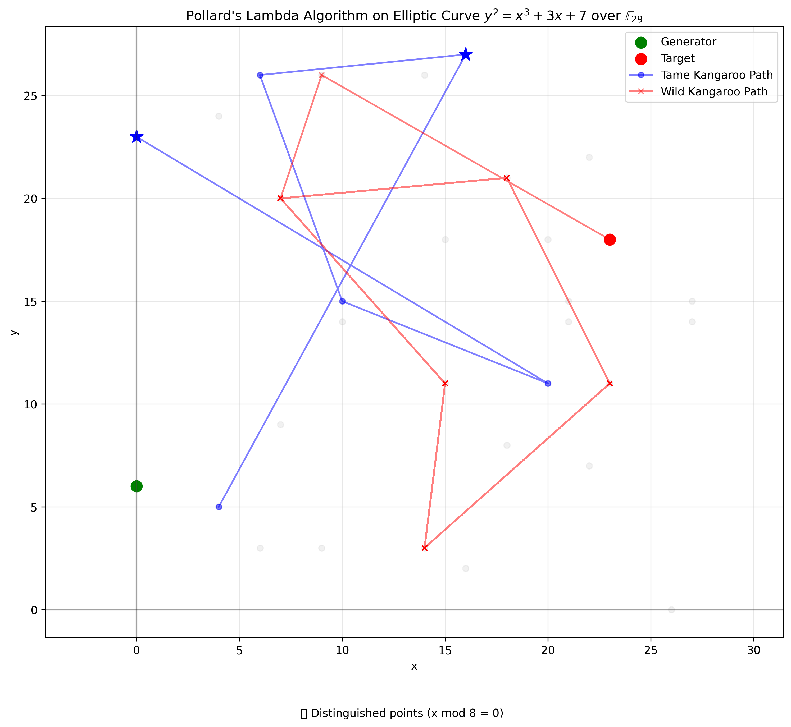

# DLP Algorithm Demonstrator

This project implements and demonstrates three algorithms for solving the Discrete Logarithm Problem (DLP):

1. **Baby-Step Giant-Step (BSGS)** - A deterministic algorithm with space complexity O(√N)
2. **Pollard's Rho** - A probabilistic algorithm with constant space complexity
3. **Pollard's Lambda (Kangaroo)** - A probabilistic algorithm designed for bounded discrete logarithms

## Visual Demonstration

Here are visualizations of all three algorithms running on the same elliptic curve:

### Baby-Step Giant-Step Algorithm


### Pollard's Rho Algorithm


### Pollard's Lambda (Kangaroo) Algorithm


*The visualizations show each algorithm finding the discrete logarithm on the elliptic curve y² = x³ + 3x + 7 over F₂₉. See the [images README](images/README.md) for detailed explanations.*

## Purpose

The program serves as an educational tool to compare and visualize how these three algorithms approach the same DLP problem. It highlights their operational differences, computational steps, and resource usage (especially space complexity).

## Usage

### Discrete Logarithm Problem in Multiplicative Groups

Run the program with:

```
python dlp_algorithms.py
```

You'll be prompted to enter:
- Prime modulus p (the size of the group ℤₚ*)
- Generator g
- Target element h (to find k where g^k ≡ h (mod p))
- Order N of the generator (optional, defaults to p-1)

The program will demonstrate each algorithm's step-by-step execution and provide a comparison of their performance metrics.

### Elliptic Curve Visualization

The project now includes visualization tools for elliptic curves over finite fields. You can use these tools to:

1. Plot all points on an elliptic curve
2. Visualize subgroups of an elliptic curve
3. Illustrate the scalar multiplication process
4. Demonstrate Pollard's Rho algorithm on elliptic curves

#### Basic Usage

For a simple visualization of an elliptic curve, run:

```
python elliptic_curve_plot.py
```

This will display a scatter plot of all points on default elliptic curves.

#### Advanced Visualization

For more advanced visualizations, use the command-line interface:

```
python ec_visualizer.py [options]
```

Available options:
- `--a`, `--b`, `--p`: Curve parameters (y² = x³ + ax + b mod p)
- `--point`: Base point for scalar multiplication (format: 'x,y')
- `--target`: Target point for Pollard's Rho (format: 'x,y')
- `--k`: Scalar value for multiplication
- `--all`: Run all visualizations
- `--plot`: Display a basic scatter plot
- `--subgroups`: Visualize subgroups
- `--scalar-mult`: Show scalar multiplication
- `--pollard-rho`: Demonstrate Pollard's Rho algorithm

Example:
```
python ec_visualizer.py --a 2 --b 3 --p 23 --all
```

## Example

For a simple DLP example, try:
- p = 101 (a small prime)
- g = 2 (a primitive root modulo 101)
- h = 30 (to find k where 2^k ≡ 30 (mod 101))

For a simple elliptic curve example, try:
- a = 2, b = 2, p = 17 (curve parameters)

## Prerequisites

- Python 3.x
- NumPy and Matplotlib (for elliptic curve visualization)

To install required packages:
```
pip install numpy matplotlib
```