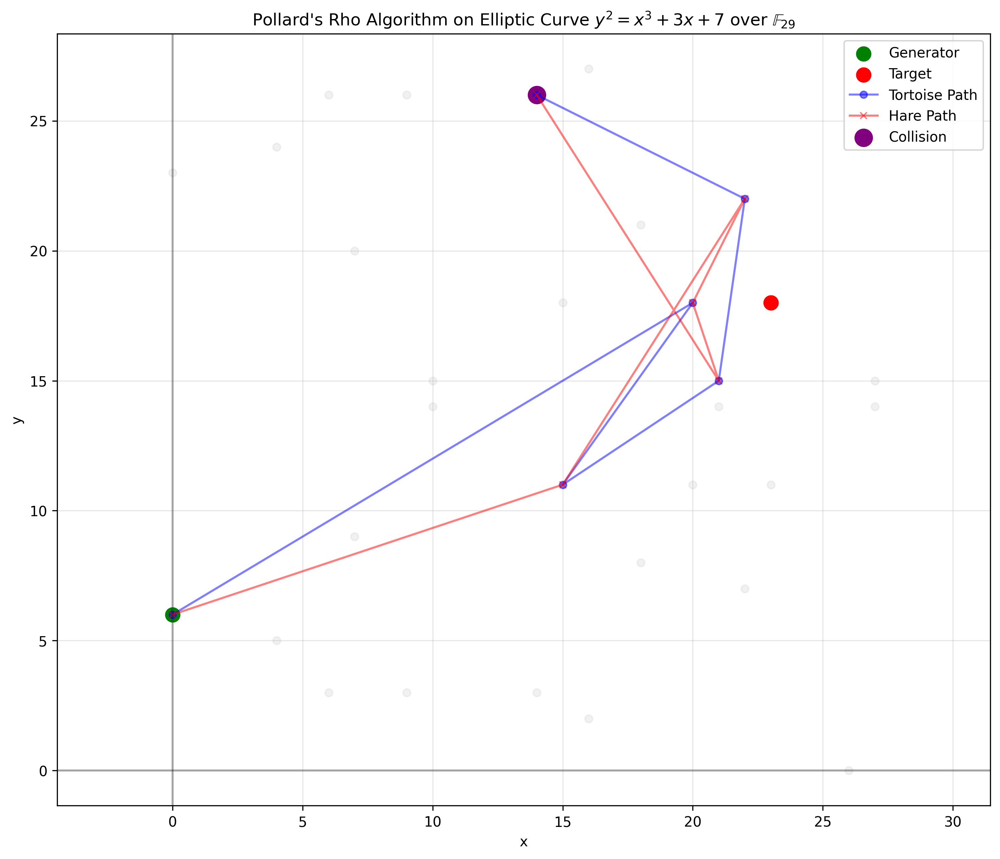

# Elliptic Curve Visualizations

This directory contains visualizations of elliptic curves and discrete logarithm algorithms running on them.

## Pollard's Rho Algorithm Visualization



This visualization shows Pollard's Rho algorithm running on the elliptic curve y² = x³ + 3x + 7 over the finite field F₂₉.

### Elements in the visualization:

- **Light gray dots**: All points on the elliptic curve
- **Green dot**: Generator point (0, 6)
- **Red dot**: Target point (23, 18), which equals 5 × (0, 6)
- **Blue line with circles**: Tortoise path (moves at normal speed)
- **Red line with X marks**: Hare path (moves at double speed)
- **Purple dot**: Collision point where tortoise and hare meet

### How Pollard's Rho Works:

1. The algorithm uses a pseudorandom walk function to traverse the elliptic curve points.
2. Two pointers (tortoise and hare) move through the points at different speeds.
3. When they collide, we can solve for the discrete logarithm k where k × Generator = Target.
4. This is a space-efficient algorithm with O(1) memory requirements and O(√n) expected time complexity.

## Generating Visualizations

You can generate these visualizations using the command:

```
python ec_visualizer.py [options]
```

For example, to generate just the Pollard's Rho visualization:

```
python ec_visualizer.py --pollard-rho
```

To create visualizations for a different curve:

```
python ec_visualizer.py --a 5 --b 9 --p 47 --pollard-rho
``` 